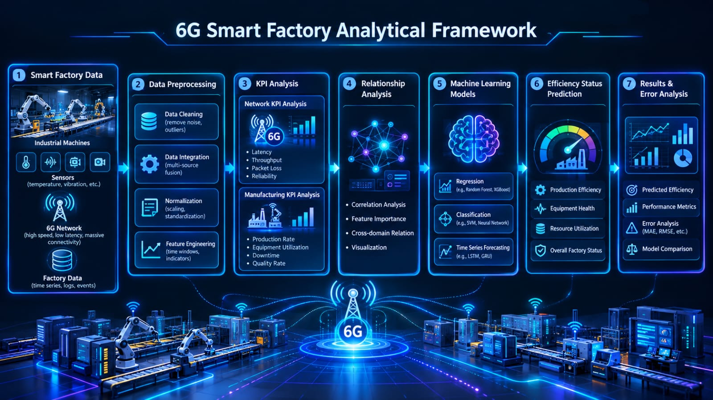
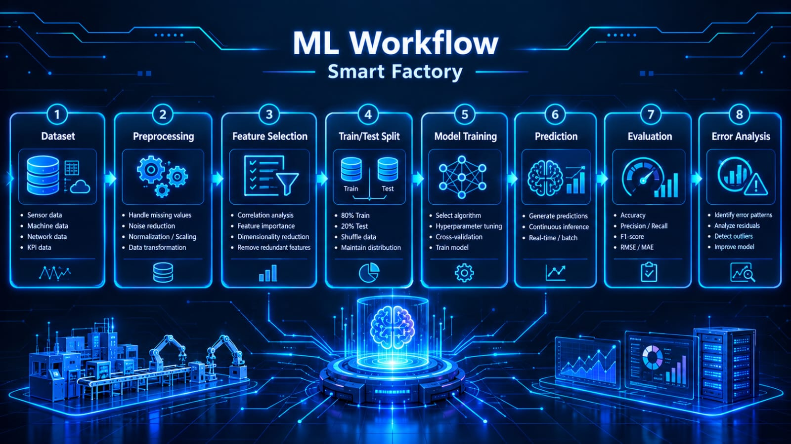
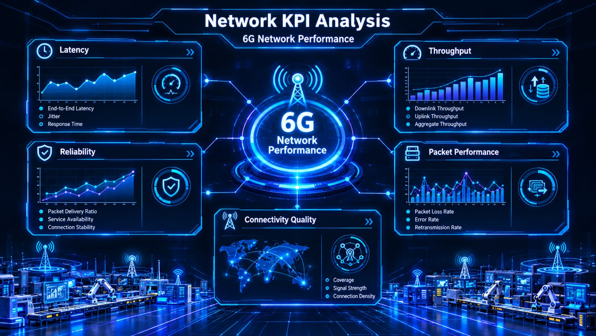
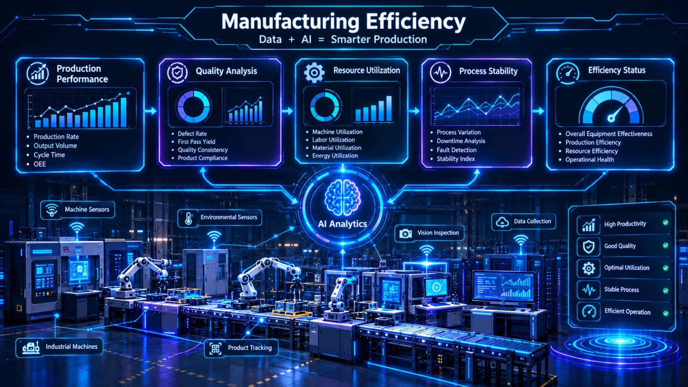
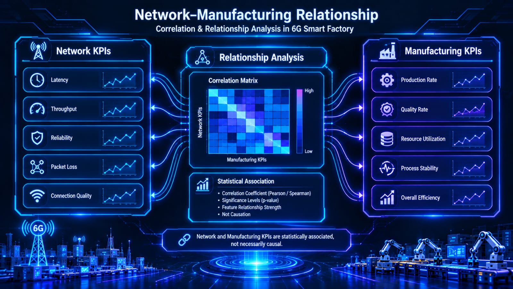
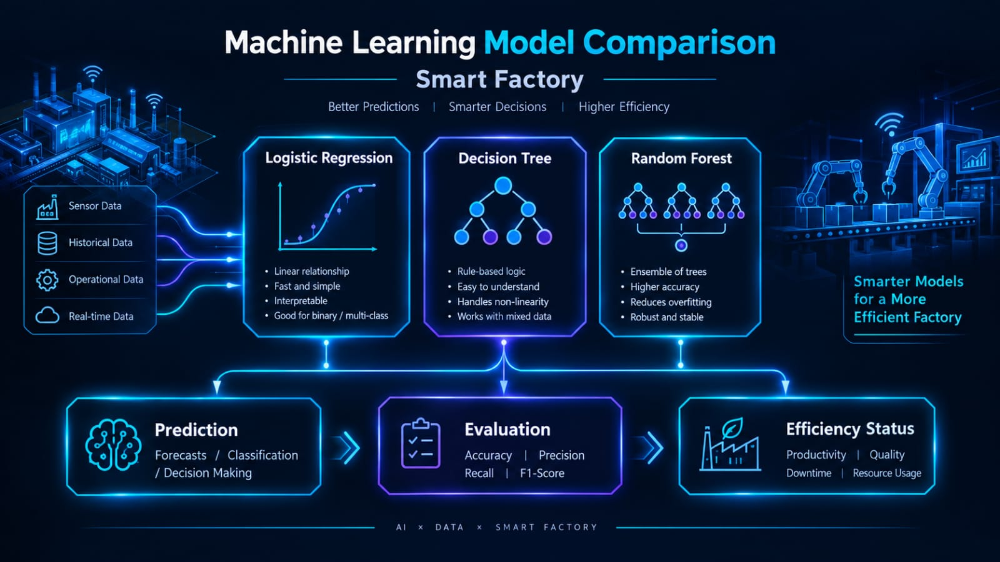

 

  

---

This project investigates how **6G network performance affects manufacturing efficiency in smart factories**.

The project combines:

**6G Networks + Data Science + Machine Learning + Manufacturing Analytics + Interactive Visualization**

The complete workflow includes:

**Data Preprocessing → Exploratory Analysis → Network KPI Analysis → Manufacturing KPI Analysis → Correlation Analysis → Machine Learning → Prediction → Error Analysis → Research Documentation → Live Streamlit Dashboard**

---

  

<table align="center">
<tr>
<th>Objective</th>
<th>Description</th>
</tr>
<tr>
<td><b>6G Analysis</b></td>
<td>Analyze important 6G network performance indicators</td>
</tr>
<tr>
<td><b>Smart Factory</b></td>
<td>Study the relationship between communication and manufacturing</td>
</tr>
<tr>
<td><b>Manufacturing</b></td>
<td>Measure production and efficiency-related KPIs</td>
</tr>
<tr>
<td><b>Correlation</b></td>
<td>Identify relationships between network and manufacturing variables</td>
</tr>
<tr>
<td><b>Machine Learning</b></td>
<td>Build predictive models using project data</td>
</tr>
<tr>
<td><b>Error Analysis</b></td>
<td>Analyze prediction errors and model performance</td>
</tr>
<tr>
<td><b>Visualization</b></td>
<td>Create clear and interactive visual analytics</td>
</tr>
<tr>
<td><b>Research</b></td>
<td>Document the complete methodology and findings</td>
</tr>
</table>

---

  

<table align="center">
<tr>

<td width="31%" align="center">

  

<b>NETWORK INTELLIGENCE</b>

  

Latency Analysis 
Packet Loss Analysis 
Error Rate Analysis 
Network Performance Index 
Network KPI Relationships

</td>

<td width="31%" align="center">

  

<b>ML INTELLIGENCE</b>

  

Feature Engineering 
Model Training 
Cross Validation 
Feature Importance 
Prediction 
Error Analysis

</td>

<td width="31%" align="center">

  

<b>MANUFACTURING INTELLIGENCE</b>

  

Production Speed 
Manufacturing Efficiency 
Defect Rate 
Manufacturing Errors 
Factory Performance

</td>

</tr>
</table>

---

  

  

---

  

→

→

→

  

→

→

→

  

→

→

→

---

  

<table align="center">
<tr>
<td align="center"><b>LATENCY</b> Communication delay</td>
<td align="center"><b>PACKET LOSS</b> Lost network packets</td>
<td align="center"><b>ERROR RATE</b> Network reliability</td>
<td align="center"><b>NETWORK INDEX</b> Overall performance</td>
</tr>
</table>

 

The project analyzes how important 6G communication KPIs relate to smart-factory manufacturing performance.

### Network Analysis

- Latency distribution
- Packet-loss distribution
- Error-rate behavior
- Latency versus efficiency
- Packet loss versus efficiency
- Latency versus production speed
- Packet loss versus production speed
- Latency versus error rate
- Network KPI correlations
- Network performance index

---

  

<table align="center">
<tr>
<td align="center"><b>EFFICIENCY</b> Overall factory performance</td>
<td align="center"><b>PRODUCTION SPEED</b> Production output</td>
<td align="center"><b>DEFECT RATE</b> Manufacturing quality</td>
<td align="center"><b>ERROR RATE</b> Manufacturing reliability</td>
</tr>
</table>

 

The project studies the relationship between network performance and manufacturing efficiency in a smart-factory environment.

---

  

### Network Distributions

 

### Network vs Manufacturing

 

### Manufacturing Analysis

 

### Advanced Analysis

 

---

  

→

→

→

→

→

### Machine Learning Analysis

- Feature engineering
- Model training
- Model comparison
- Cross-validation
- Feature importance
- Prediction generation
- Prediction error analysis
- Final model selection

### Machine Learning Files

- `results/final_model.pkl`
- `results/label_encoder.pkl`
- `results/model_results.csv`
- `results/cross_validation_results.csv`
- `results/feature_importance.csv`
- `results/predictions.csv`
- `results/prediction_errors.csv`

---

  

  

Feature importance helps identify which project variables contribute most strongly to the trained machine-learning model.

---

 

The project produces structured analytical outputs for understanding:

<b>6G NETWORK PERFORMANCE</b>

↓

<b>SMART FACTORY OPERATIONS</b>

↓

<b>MANUFACTURING EFFICIENCY</b>

### Results Generated

| Result | Output |
|---|---|
| Correlation Analysis | `correlation_matrix.csv` |
| Network Findings | `network_findings.csv` |
| Manufacturing Findings | `manufacturing_findings.csv` |
| Model Results | `model_results.csv` |
| Cross Validation | `cross_validation_results.csv` |
| Feature Importance | `feature_importance.csv` |
| Predictions | `predictions.csv` |
| Prediction Errors | `prediction_errors.csv` |
| Project KPIs | `project_kpis.csv` |
| Research Summary | `research_summary.csv` |

---

  

  

---

The project includes a complete IEEE-style research paper covering:

- Introduction
- Smart factory background
- 6G network requirements
- Dataset and methodology
- Network KPI analysis
- Manufacturing KPI analysis
- Correlation analysis
- Machine learning methodology
- Results
- Discussion
- Conclusion
- Future scope
- References

### Research Paper

**Main Paper:**

`research_paper/6G_Smart_Factory_IEEE_Research_Paper.pdf`

**Source:**

`research_paper/6G_Smart_Factory_Research_Paper.md`

### Reference Study

**Engin Zeydan, Suayb Arslan, Yekta Turk**

**6G wireless communications for industrial automation: Scenarios, requirements and challenges**

Journal of Industrial Information Integration, Volume 42, Article 100732, 2024.

DOI: `10.1016/j.jii.2024.100732`

---

  

 

<b>Figure 1 — Overall Project Framework</b>

  

 

<b>Figure 2 — Machine Learning Workflow</b>

  

 

<b>Figure 3 — Network KPI Analysis</b>

  

 

<b>Figure 4 — Manufacturing Efficiency</b>

  

 

<b>Figure 5 — Network-Manufacturing Relationship</b>

  

 

<b>Figure 6 — Machine Learning Model Comparison</b>

---

  

 ↓ 

 ↓ 

 ↓ 

 ↓ 

 ↓ 

 ↓ 

 ↓ 

---

<pre>
6G-Smart-Factory-Network-Analysis/
│
├── data/
├── notebooks/
├── scripts/
│
├── graphs/
│   ├── latency_distribution.png
│   ├── packet_loss_distribution.png
│   ├── efficiency_distribution.png
│   ├── production_speed_distribution.png
│   ├── latency_vs_efficiency.png
│   ├── packet_loss_vs_efficiency.png
│   ├── latency_vs_error_rate.png
│   ├── latency_vs_production_speed.png
│   ├── packet_loss_vs_error_rate.png
│   ├── packet_loss_vs_production_speed.png
│   ├── defect_rate_by_efficiency.png
│   ├── production_speed_by_efficiency.png
│   ├── network_performance_index.png
│   ├── network_vs_manufacturing_importance.png
│   └── feature_importance.png
│
├── results/
│   ├── correlation_matrix.csv
│   ├── cross_validation_results.csv
│   ├── efficiency_percentage.csv
│   ├── efficiency_summary.csv
│   ├── feature_importance.csv
│   ├── manufacturing_findings.csv
│   ├── network_findings.csv
│   ├── network_manufacturing_correlations.csv
│   ├── network_manufacturing_relationships.csv
│   ├── network_relationships.csv
│   ├── model_results.csv
│   ├── predictions.csv
│   ├── prediction_errors.csv
│   ├── project_kpis.csv
│   └── research_summary.csv
│
├── research_paper/
│   ├── 6G_Smart_Factory_IEEE_Research_Paper.pdf
│   ├── 6G_Smart_Factory_Research_Paper.md
│   ├── Figure1_Overall_Framework.png
│   ├── Figure2_ML_Workflow.png
│   ├── Figure3_Network_KPI_Analysis.png
│   ├── Figure4_Manufacturing_Efficiency.png
│   ├── Figure5_Network_Manufacturing_Relationship.png
│   ├── Figure6_ML_Model_Comparison.png
│   └── create_ieee_paper.py
│
├── app.py
├── requirements.txt
└── README.md
</pre>

---

  

<table align="center">
<tr>
<th>Phase</th>
<th>Major Work</th>
</tr>
<tr>
<td>Days 1–5</td>
<td>Project setup, dataset understanding and preprocessing</td>
</tr>
<tr>
<td>Days 6–10</td>
<td>Exploratory data analysis and visualization</td>
</tr>
<tr>
<td>Days 11–15</td>
<td>6G network KPI analysis</td>
</tr>
<tr>
<td>Days 16–20</td>
<td>Manufacturing efficiency analysis</td>
</tr>
<tr>
<td>Days 21–24</td>
<td>Correlation and relationship analysis</td>
</tr>
<tr>
<td>Days 25–27</td>
<td>Machine learning and model evaluation</td>
</tr>
<tr>
<td>Days 28–29</td>
<td>Prediction, error analysis and research documentation</td>
</tr>
<tr>
<td>Day 30</td>
<td>Streamlit dashboard, final integration and project presentation</td>
</tr>
</table>

---

  

  

---

  

  

---

  

<b>6G NETWORK INTELLIGENCE</b>

 ↓ 

<b>REAL-TIME INDUSTRIAL DATA</b>

 ↓ 

<b>MACHINE LEARNING</b>

 ↓ 

<b>MANUFACTURING INSIGHTS</b>

 ↓ 

<b>SMART FACTORY OPTIMIZATION</b>

  

  

  

